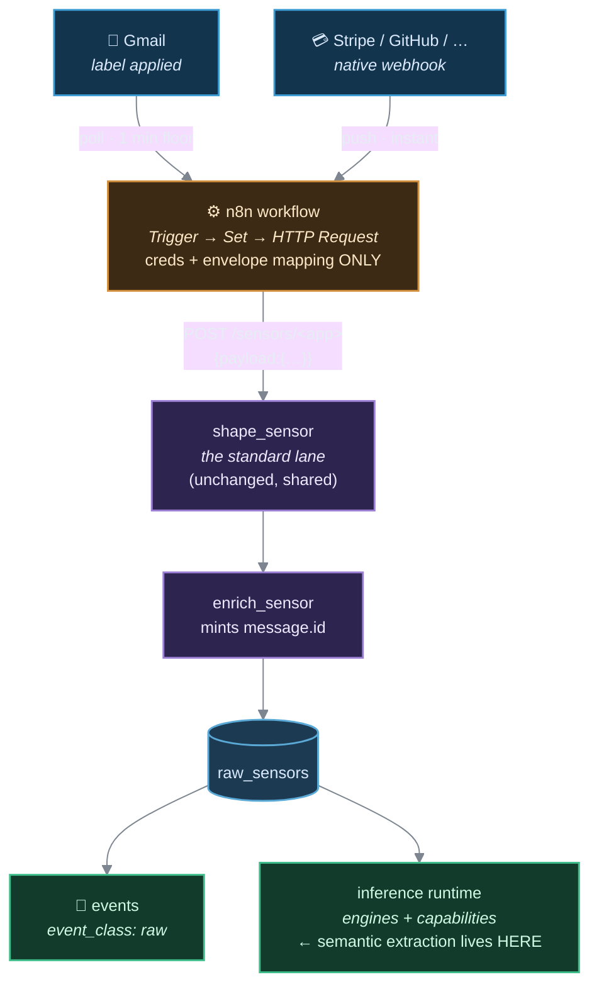

# Connectors — third-party sources via n8n

> **The reference for adding a third-party data source.** The *why* lives in
> [ADR 0008](adr/0008-connector-tier-via-n8n.md); this file is the operational contract.
> A connector is not a worker and not a Vector transform — it is an **n8n workflow** that
> authenticates to some third party, fetches, renames fields onto the canonical ingest
> contract below, and POSTs to the existing ingest gateway.

A connector adds a source without adding a component. Nothing in [`src/`](../src/),
nothing in [`workers/`](../workers/), and — the load-bearing part — **no new Vector
transform**.



## 1 · The boundary rule

This is what makes it acceptable for connector logic to live outside git.

> **An n8n workflow may authenticate, fetch, and rename/reshape fields onto the canonical
> contract. It may not threshold, correlate, window, join across events, or decide that
> something happened.** Anything that constitutes an inference stays in
> [`events/*.yml`](../events/) and [`src/inference/`](../src/inference/).

Hold it and n8n is a driver — the same class of producer as the iOS Shortcuts, which are
already GUI-configured, not in git, and load-bearing for `device_connected_to_carplay`,
`car_lock_state_change` and `credit_card_payment`. Break it and inference becomes
un-testable, un-replayable, and invisible to [`backtest.py`](../scripts/backtest.py).

**The checkable version:** if a source's mapping needs more than a **Set** node, it is not
envelope mapping — it is semantics, and it belongs downstream in git. *A Code node is the
smell.*

## 2 · Where transformation lives

`owntracks_to_canonical` and `overland_to_canonical` exist for one reason: those apps POST
**directly** at us with a body shape outside our control. n8n inverts that — with n8n in
the middle the body is ours again, so a Set node emits canonical shape and the standard
lane suffices. **n8n is the reason we stop writing VRL adapters, not another source of
them.**

| Duty | Where | Why there |
|---|---|---|
| Envelope mapping (`event_name`, `user_id`, `timestamp`) | n8n **Set** node | ~5 fields, per-source, genuinely trivial |
| Field selection / trimming (drop a 500 KB mail body) | n8n | must happen **before** the ~1 MiB ingress and Kafka ceilings |
| Batch fan-out (one payload → N events) | n8n **Split Out** | this is Overland's VRL fan-out duty, available natively |
| **Semantic extraction** (merchant, amount, carrier, status) | **`src/inference/` — after Kafka** | in git, pytest-able, and **replayable** |
| Inference (thresholds, correlation, sessions) | [`events/*.yml`](../events/) | already the rule |

**Why extraction goes after Kafka**, rather than into n8n or a pre-Vector shaper worker —
this is [invariant 19](invariants.md) (*raw signals are the truth; derived is a cache*). A
parser that runs **before** Kafka destroys whatever it misparses, irrecoverably. A parser
that runs **after** leaves the raw body retained in Neon, so a bug is fixed by correcting the
parser and re-running [`rederive.py`](../scripts/rederive.py). That single argument is why
this tier needs no new component.

Mechanically, extraction is the existing capability seam: capabilities are derived in
`Shaper.shape` from a `Decision`'s full source bodies ([invariant 12](invariants.md)), so it
requires a definition that fires. For email that is
`email_labeled_receipts` (raw) → an `on_event` engine → `email_receipt` (derived) carrying a
`vendor`/`amount` capability read off the raw body.

## 3 · The ingest contract

```
POST https://vector.prod.rods.me/sensors/<app>
Content-Type: application/json

{"payload": { … }}
```

`<app>` becomes `source_app`. It must **not** be `owntracks` or `overland` (those have
bespoke adapters); anything else falls through `route_by_app` to the `standard` lane. The
domain segment must stay `sensors` — see the constraint below.

| Field | Required | Notes |
|---|---|---|
| `event_name` | ✅ | `snake_case`; becomes `message.name`, the routing key engines match on |
| `user_id` | ✅ | `rods` today. The field most often got wrong in a GUI — see the hazard below |
| `timestamp` | ✅ | **integer epoch seconds**, and the *source's* event-time, not fetch time ([invariant 4](invariants.md)) |
| `n8n_polled_at` | recommended | int epoch seconds at fetch time — the only thing that makes trigger lag separable from pipeline lag |
| `upstream_id` | recommended | the source's own stable id (a Gmail message id, a Stripe event id). **Use this exact name** — it is what `connector_eval.py` groups on, so one canonical field means the tooling works for every connector with no per-source config. Source-specific extras (`gmail_thread_id`) are fine alongside it |
| `id` | ❌ **forbidden** | Vector mints a uuid4 in `enrich_sensor`. See hazard 2 |
| `inference_type`, `derived_from` | ❌ **forbidden** | they mark a *derived* event and would mis-class the row as `event_class: 'derived'` |

Everything else passes into the `message` JSONB column **verbatim** — a new source never
needs a migration. Ceiling ~1 MiB (see hazard 3).

> **Connectors must stay inside the `sensors` domain.** A new domain gets its own Kafka
> topic, and the runtime requires **exactly one** external source topic — `declared_sources
> - sink_topics` must be a single entry or `RoutingPlan.from_definitions` raises at startup
> ([invariant 6](invariants.md), [ADR 0004](adr/0004-scaling-model.md)). A separate feed is
> merged at *ingest*, never by adding a source.

## 4 · Three hazards n8n does not solve

**1 · A `200` means nothing.** `http_server_data_in` acknowledges on **receipt**, so every
downstream failure is a silent drop plus a Vector log line — a connector cannot detect
rejection from the HTTP response. Worse, `shape_sensor` validates only that `event_name` and
`user_id` *exist*: a **string** `timestamp` passes ingest and breaks later, because
`capabilities.py` and `core._lineage` use bracket access on `message["timestamp"]`. Always
verify a new connector's first event in SQL, checking `jsonb_typeof`.

**2 · Never derive the event id from an upstream id.** Tempting for idempotency, but
`events.id` is a `uuid` primary key, Vector's `postgres` sink has **no `ON CONFLICT`
support**, and one constraint violation **fails the entire batch** — up to 500 events, with
`buffer.when_full: block`. A single duplicate would stall persistence for *unrelated*
sources. Send no `id`, and keep the upstream id as an ordinary body field so duplicates are
**detectable but never fatal** — degrade, don't wedge ([invariant 18](invariants.md)).

**3 · Ceilings and authentication.** The nginx ingress sets no `proxy-body-size`, so the
1 MiB default applies, and Kafka's per-message default is also ~1 MiB — trim payloads in
n8n, and carry an upstream id so the full document can be re-fetched instead of shipped.
Separately, `http_server_data_in` has **no `auth` block**: the endpoint is public and anyone
who guesses the URL can mint events. Tolerable for phone Shortcuts, less so as this tier
grows — see the open item in [ADR 0008](adr/0008-connector-tier-via-n8n.md).

## 5 · Measuring a connector

Run [`scripts/connector_eval.py`](../scripts/connector_eval.py). It reports, per
`source_app`: **latency** (trigger lag vs pipeline lag vs end-to-end, p50/p95/max),
**duplicates**, and **freshness**. Completeness is the one it cannot self-check — compare a
count at the source against Neon for the same window.

Two calibration facts, measured 2026-07-28 on the real lane:

- **Pipeline lag is ~3.3s, not sub-second** (Vector sink linger + the persister's
  `batch.timeout_secs: 1` + Neon waking from scale-to-zero). Judge against ~3s.
- **n8n's Gmail Trigger polls, with a 1-minute floor** — it is not push, so mail trigger lag
  is 0–60s by construction. Genuine webhook sources (Stripe, GitHub, Todoist) are instant.

**Freshness is the risk that matters.** n8n being down produces *silence*, and silence is
indistinguishable from "nothing happened at the source." There is no alerting in this repo
yet, so this is a query you have to run rather than something that pages you. First real
instance, on day one: a Gmail credential whose refresh token had been dead for four months
produced exactly this — a failure entirely inside n8n, nothing at Vector, no row in Neon.

> ⚠️ **Counting for the completeness check: count what the API returns, not what the UI shows.**
> Gmail's UI labels a **conversation**; the API returns **messages**. Labelling 12 conversations
> put **15** rows in Neon — not a duplicate bug (all 15 had distinct `upstream_id`s), just two
> different units. Compare message counts on both sides or the loss rate is meaningless.

## 6 · Adding a connector

1. Build the workflow: **Trigger → Set → HTTP Request**, posting to `/sensors/<app>`. Keep it
   three nodes. Author it as `@n8n/workflow-sdk` code and push it in with `validate_workflow` →
   `create_workflow_from_code`, passing **`projectId` and `folderId`** so it lands in the
   `Aware connectors` folder — an existing workflow cannot be moved into a folder via the API,
   only created into one. See [`connectors/README.md`](../connectors/README.md).
2. Verify the first event in SQL (`jsonb_typeof(message->'timestamp') = 'number'`,
   `event_class = 'raw'`, `occurred_at` = the source's event time, not the poll time).
3. **Export the workflow JSON and commit it** to [`connectors/n8n/`](../connectors/) — a
   versioned record, not the deployment source. See that directory's README.
4. Add the app to the producer table in [`vector-pipeline.md`](vector-pipeline.md).
5. Run `connector_eval.py` to establish the source's baseline.

## See also

- [ADR 0008 — connector tier via n8n](adr/0008-connector-tier-via-n8n.md) — the decision,
  the alternatives, and what would falsify it.
- [vector-pipeline.md](vector-pipeline.md) — the ingest gateway this posts into, and the
  two-level URL grammar.
- [invariants.md](invariants.md) — rules 4 (one event-time), 6 (one external source topic),
  12 (full source bodies), 18 (errors isolate), 19 (raw is the truth).
