# The inference core — `src/inference/`

> **Status: current truth for `src/`.** Supersedes `architecture.md` and `classes.md` (deleted
> 2026-07-27; they described the removed pre-Quix threaded runtime — read them in git history if
> you want the archaeology). The normative rule list lives in [`invariants.md`](invariants.md);
> this document explains *how* and *why*, and is the field reference for every module.
>
> Written for whoever touches `src/` next — future you after a month away, or a fresh Claude
> session. It assumes the ADRs: [0004](adr/0004-scaling-model.md) is the architecture,
> [0002](adr/0002-recursive-derivation.md) the derivation semantics,
> [0005](adr/0005-session-gated-derivation.md) the gate, [0007](adr/0007-stays-not-fences.md)
> stays and places.

**Contents**

| Part | | |
|---|---|---|
| **Narrative** | [1](#1-the-one-page-model) | The one-page model |
| | [2](#2-the-import-rule-that-shapes-everything) | The import rule that shapes everything |
| | [3](#3-a-trace-one-location_ping-becomes-a-stay) | A trace: one `location_ping` becomes a `stay` |
| | [4](#4-detection-vs-shaping) | Detection vs shaping — and the `sources` sidecar |
| | [5](#5-recursion-without-kafka) | Recursion without Kafka |
| | [6](#6-entity-keying-and-state) | Entity keying and state |
| | [7](#7-enrichment-capabilities-scale-by-addition) | Enrichment: capabilities scale by addition |
| | [8](#8-reference-data-one-table-two-kinds) | Reference data: one table, two kinds |
| | [9](#9-the-contract-schemaless-at-rest-typed-in-memory) | The contract: schemaless at rest, typed in memory |
| **Reference** | [10](#10-module-reference) | Module reference |
| | [11](#11-engine-reference) | Engine reference |
| | [12](#12-capability-reference) | Capability reference |
| | [13](#13-state-key-layout) | State key layout |
| | [14](#14-failure-modes) | Failure modes — what breaks, how loudly |
| | [15](#15-recipes) | Recipes: add an event / engine / capability, replay history |
| | [16](#16-gotchas) | Gotchas |

---

## 1. The one-page model

An inference event is **data** — a YAML file in [`events/`](../events/). One generic runtime
loads every definition and runs them all in a single Quix Streams `Application`: one process,
one consumer group, one keyed pipeline.

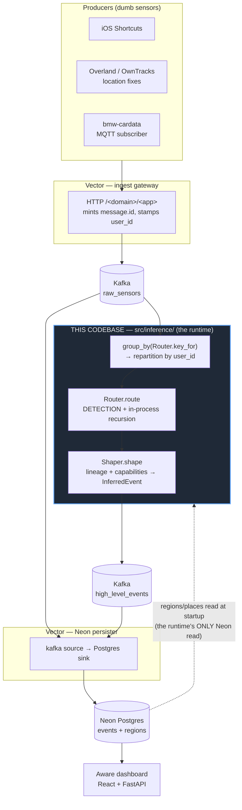

Everything inside the highlighted box is 1,581 lines of Python in 18 files. Its whole job:

1. **Load** definitions (YAML on disk + region rows from Neon) into `EventDefinition`s.
2. **Plan** a `RoutingPlan` — which engines consume which event names, where each result goes.
3. **Route** each incoming event to its engines, resolving multi-hop derivation in-process.
4. **Shape** each firing into an `InferredEvent`, deriving its declared capabilities.
5. **Produce** the result to its sink topic.

Steps 2–4 are transport-agnostic. Only step 1's Neon read and step 5 know about the outside world.

### Module inventory

| File | Lines | Role | May import |
|---|---|---|---|
| [`event.py`](../src/inference/event.py) | 148 | The domain model — `InferredEvent`, `Capability`, `Interval`, `Place`, `Contributor` | pydantic only |
| [`capabilities.py`](../src/inference/capabilities.py) | 138 | The **enricher seam** — capability registry + derivers | `event`, `geo` |
| [`geo.py`](../src/inference/geo.py) | 55 | Haversine + the implausible-jump guard | `math` |
| [`engines/base.py`](../src/inference/engines/base.py) | 102 | `Engine` protocol, `Decision`, `ScopedState`, the registry | stdlib |
| [`engines/*.py`](../src/inference/engines/) | 53–107 ea. | Six strategies | `engines.base`, `geo` |
| [`runtime/definition.py`](../src/inference/runtime/definition.py) | 59 | `EventDefinition` — the YAML schema + loader | pydantic, yaml, `event` |
| [`runtime/config.py`](../src/inference/runtime/config.py) | 45 | Env-backed settings, read lazily | `os` |
| [`runtime/core.py`](../src/inference/runtime/core.py) | 276 | `RoutingPlan`, `Router`, `Shaper`, `StateStore` port | all of the above |
| [`runtime/regions.py`](../src/inference/runtime/regions.py) | 85 | Neon `regions` rows → geofence definitions | psycopg (**lazy**) |
| [`runtime/places.py`](../src/inference/runtime/places.py) | 50 | Neon POI rows → the place book | psycopg (**lazy**) |
| [`runtime/quix.py`](../src/inference/runtime/quix.py) | 102 | **The only file that imports `quixstreams`** — adapter + composition root | everything |

---

## 2. The import rule that shapes everything

> **Rule.** [`runtime/core.py`](../src/inference/runtime/core.py) and everything it imports MUST
> NOT import `quixstreams` — or any other transport or state backend.

This single line is the reason the code is split the way it is. It is not tidiness; it is what
makes the derivation graph portable and testable without a broker.

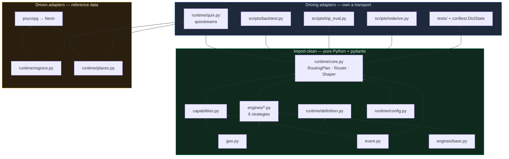

**The seam is load-bearing, not aspirational.** Five independent adapters already drive the same
core:

| Adapter | State backend | What it proves |
|---|---|---|
| `runtime/quix.py` | Quix `State` (RocksDB + changelog) | production |
| `tests/` (7 files) | `conftest.DictState` — a 10-line dict | the core runs with zero infrastructure |
| `scripts/backtest.py` | dict | replay Neon history through the real router to see *what* a weight change does |
| `scripts/trip_eval.py` | dict | score a candidate weight map (junk trips vs missed drives) |
| `scripts/rederive.py` | dict | rebuild derived history from retained raws, then produce it |

`psycopg` in `regions.py` / `places.py` is imported **inside the function**, not at module scope,
for the same reason: the in-memory paths must not need a database driver present.

**CI enforces it.** [`_ci-checks.yml`](../.github/workflows/_ci-checks.yml) installs the package
with `pip install -e . --no-deps` and only `pytest pydantic pyyaml ruff` — so a stray
`import quixstreams` in tested code fails the build loudly instead of passing on the back of an
incidentally-installed dependency.

### The three ports

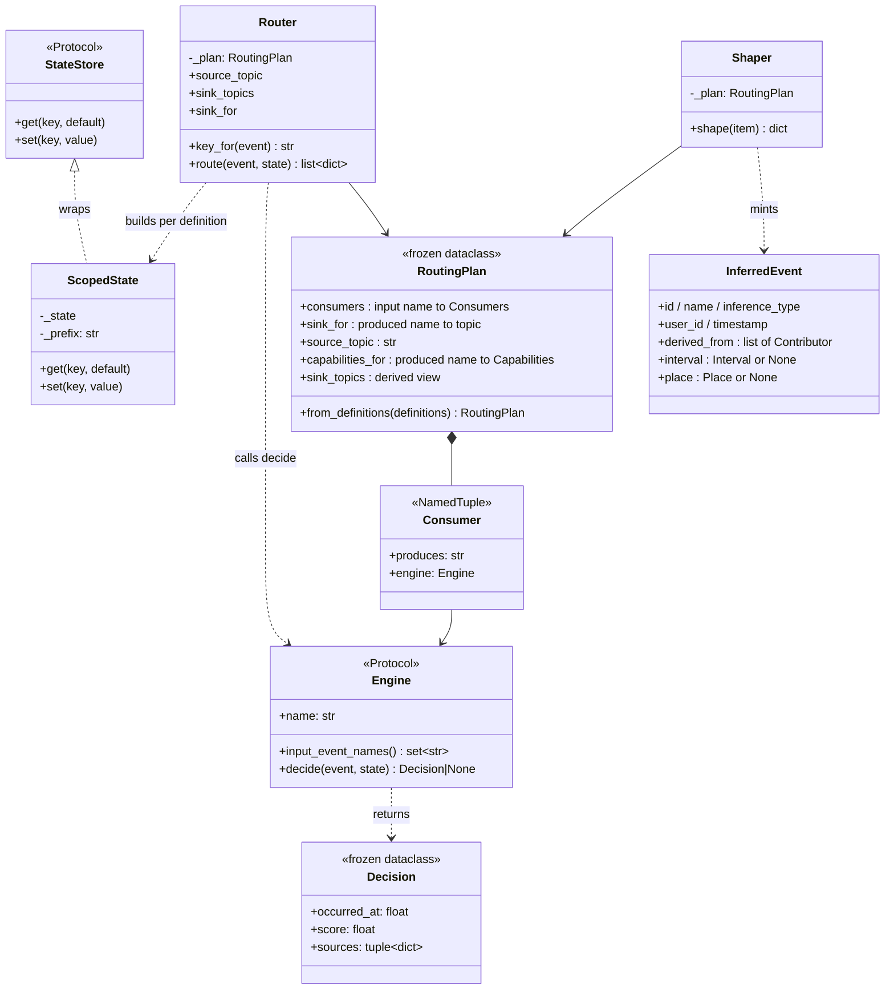

- **`StateStore`** — the state port. `get`/`set`, nothing else. Quix `State` satisfies it
  structurally; so does a dict.
- **`Engine`** — the strategy port. A plain event dict in, a `Decision` or `None` out.
- **`Router` / `Shaper`** — the inbound ports an adapter mounts. `route`'s signature
  `(event, state) -> list[dict]` deliberately matches Quix's stateful-callback shape, so
  [quix.py:55](../src/inference/runtime/quix.py#L55) mounts it with **no lambda** — the port is
  explicit, and the adapter never touches a bare core function.

**Deliberately absent:** a `RuntimeProtocol` abstracting the transport. There is one broker and one
intended state backend; a protocol over a single implementation is speculative indirection. The rule
is *cohesion plus an import boundary*, not polymorphism (ADR 0004).

---

## 3. A trace: one `location_ping` becomes a `stay`

The best way to understand the pipeline is to follow one event through every hop. This is the real
path that produced "96.8 minutes at a shop" on 2026-07-25.

### The topology, in five lines

[`_wire_topology`](../src/inference/runtime/quix.py#L40) is the entire dataflow:

```python
sinks = {t: app.topic(t, value_serializer="json") for t in sorted(router.sink_topics)}
sdf = app.dataframe(app.topic(router.source_topic, value_deserializer="json"))
sdf = sdf.group_by(router.key_for, name="entity")          # repartition by user_id
sdf = sdf.apply(router.route, stateful=True, expand=True)   # 1 event → N decisions
sdf = sdf.apply(shaper.shape)                               # decision → emitted record
sdf.to_topic(lambda value, key, ts, headers: sinks[router.sink_for[value["name"]]])
```

`expand=True` is what lets one incoming ping produce zero, one, or several derived events —
`route` returns a list and Quix flattens it into separate downstream messages.

### Hop by hop

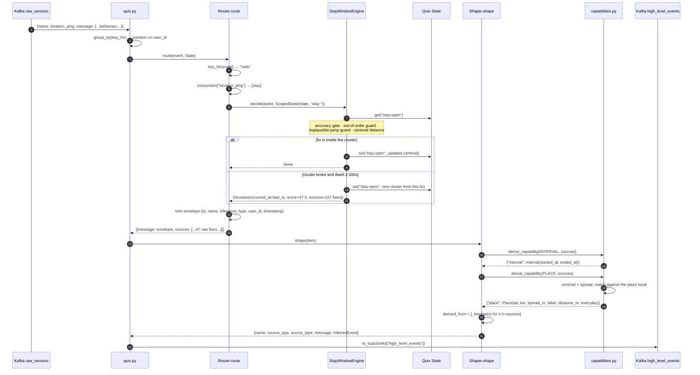

### The data, at each hop

**In** — what Vector put on `raw_sensors` (the wrapper is Vector's; `message.id` and
`message.user_id` are stamped at ingest):

```json
{
  "name": "location_ping",
  "source_app": "overland",
  "source_type": "http_server",
  "message": {
    "id": "9f2c…", "name": "location_ping", "user_id": "rods",
    "timestamp": 1753436412, "lat": 47.19503, "lon": 8.52411, "acc": 12
  }
}
```

**State**, after 47 such fixes — one key, O(1) regardless of cluster size except for the retained
source bodies:

```
stay:open = {clat: 47.19501, clon: 8.52409, n: 47,
             first_ts: 1753430601, last_ts: 1753436412,
             last_lat: …, last_lon: …, events: [<47 full event dicts>]}
```

**The `Decision`** when a fix finally lands outside the 60 m radius:

```python
Decision(occurred_at=1753436412,   # the last fix INSIDE — the true end, not the breaking fix
         score=47.0,               # fixes supporting the stay; detection-local, never emitted
         sources=(<47 full event dicts>))
```

**Out** — the record produced to `high_level_events`. The wrapper is byte-for-byte the same shape
Vector mints for raw events, so every topic in the system carries one envelope shape:

```json
{
  "name": "stay",
  "source_app": "inference",
  "source_type": "kafka",
  "message": {
    "id": "c1a7…", "name": "stay", "inference_type": "stay_window",
    "user_id": "rods", "timestamp": 1753436412,
    "derived_from": [{"id": "9f2c…", "name": "location_ping", "timestamp": 1753430601}, "…46 more"],
    "interval": {"started_at": 1753430601, "ended_at": 1753436412, "duration_seconds": 5811},
    "place": {"lat": 47.19501, "lon": 8.52409, "spread_m": 38.4,
              "label": "Konditorei", "distance_m": 11.2, "everyday": false}
  }
}
```

Note what did **not** survive: the 47 full source bodies. They exist only in-process, so capability
derivers can read fields the lineage doesn't carry. What ships is the trimmed
`{id, name, timestamp}` projection plus whatever the capabilities distilled.

---

## 4. Detection vs shaping

Two `apply` steps, two concerns, deliberately not one function.

| | `Router.route` (detection) | `Shaper.shape` (shaping) |
|---|---|---|
| Question answered | *Did* something fire, and with what identity? | What *data* does the fired event carry? |
| Stateful | yes — per-entity `State` | no — pure map |
| Knows about | the consumer graph, engines, recursion | the domain model, capabilities, lineage |
| Mints | `id`, `name`, `inference_type`, `user_id`, `timestamp` | `derived_from`, `interval`, `place`, the wrapper |
| Never touches | lineage, capabilities, the wrapper | state, engines, routing |

This split is what lets the inference logic and the data model evolve independently. Adding the
`place` capability (ADR 0007) touched `capabilities.py`, `event.py` and one YAML file — `route` did
not change, and no engine changed.

### The `sources` sidecar — the subtle bit

`route` returns items shaped `{"message": envelope, "sources": [...]}`. That `sources` key is a
**sidecar for the next stage only**. The event re-enqueued for recursion is the *clean* envelope,
without it:

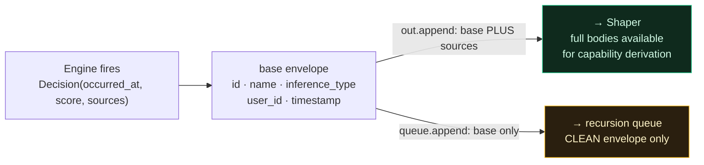

Why it matters: an engine consuming a derived event stores that event in its window state. If the
recursed event carried its sources, each hop would nest the previous hop's full bodies inside the
next — state would fatten geometrically down a derivation chain, and the changelog with it.

> **Consequence you will trip over.** A derived event, as seen by a downstream engine, carries
> **only** `{id, name, inference_type, user_id, timestamp}`. No `derived_from`, no `interval`, no
> `place` — even though the version produced to Kafka has all three. So a definition whose sources
> are *derived* events cannot usefully declare a geo capability: `arrived_home_by_car` derives from
> `entered_home` + `got_out_the_car`, neither of which carries `lat`/`lon` in-process, so
> `capabilities: [place]` there would silently yield no fragment. (`_place` returns `{}` rather than
> fabricating a point — see [capabilities.py:126](../src/inference/capabilities.py#L126).) The
> `place` capability only works on definitions fed by **raw geo fixes**.

---

## 5. Recursion without Kafka

A derived event is a valid contributor to further derivations (ADR 0002). The obvious
implementation — consume your own sink topic — was tried and abandoned: Quix's `concat()` of two
source topics with `auto_offset_reset=latest` consumes **zero** messages (bisected in-cluster, ADR
0004). The fix turned out to be the better design anyway.

`route` walks a queue. A fired event is fed back through the consumers map *within the same call*,
against the same entity's persisted state:

```python
queue, out = [event], []
while queue:
    ev = queue.pop(0)
    name = (ev.get("message") or {}).get("name")
    for c in self._plan.consumers.get(name, []):
        decision = c.engine.decide(ev, ScopedState(state, f"{c.produces}:"))
        if decision:
            base = {...}
            out.append({**base, "sources": list(decision.sources)})
            queue.append(base)
```

Derived events are still produced to `high_level_events` — for persistence and external consumers —
they are just never re-consumed.

### The live derivation graph

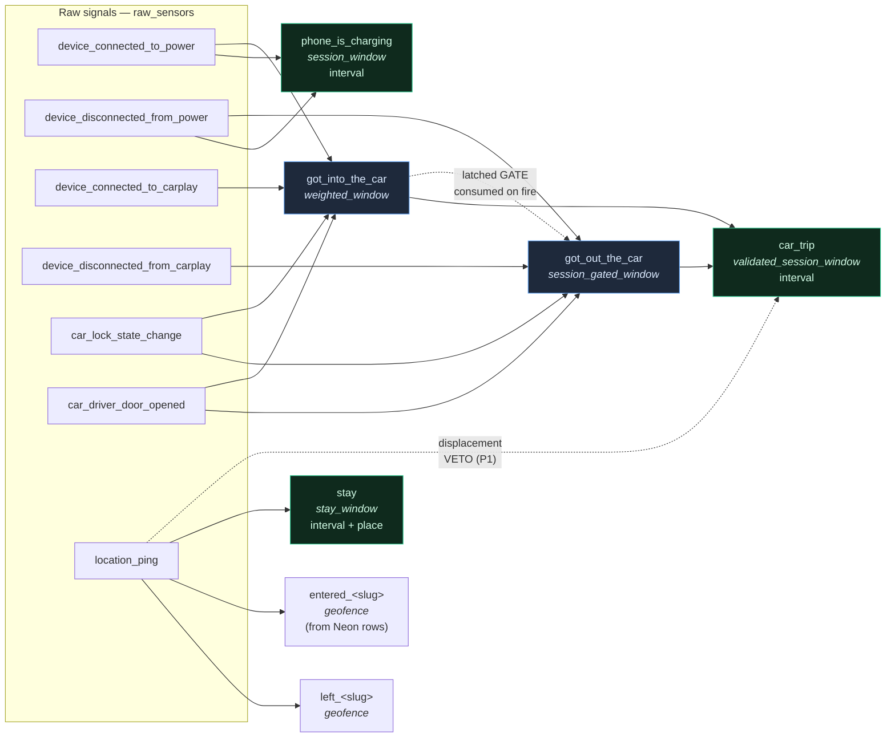

`entered_<slug>` / `left_<slug>` currently feed **nothing**. The `arrived_home_by_car` /
`left_home_by_car` pair that consumed them was deleted 2026-08-01 (issue #6): both fired 17 times
each and then stopped dead on 2026-07-25 when the OwnTracks waypoints were removed, and the stay/place
pivot (ADR 0007) had already made zone-crossing the *less* useful way to detect being somewhere. The
geofence engine itself stays — it is synthesized from `regions` rows, so seeding a zone still produces
transitions; there is simply no derivation layered on them today.

A single `car_lock_state_change` therefore does a lot of work in one `route` call: it may fire
`got_into_the_car`, which is immediately re-queued, which opens `got_out_the_car`'s gate *and*
stashes the open start in `car_trip`'s state — all before the call returns, with no Kafka
round-trip and no latency.

**Termination.** The graph stays a DAG because a name absent from `consumers` matches nothing and
stops the cascade, and no definition consumes its own output. There is no cycle detection — the
guarantee comes from the definitions, so don't write a definition that consumes what it produces.

**Caveat.** This assumes the runtime is the only producer of derived events. True today; an external
producer writing to `high_level_events` would not be seen.

---

## 6. Entity keying and state

### The key

[`Router.key_for`](../src/inference/runtime/core.py#L154) is the whole keying policy:

```python
msg = event.get("message", {}) if isinstance(event, dict) else {}
user_id = msg.get("user_id")
if not user_id:
    logger.warning("event has no user_id; bucketing under '_no_user_id' (name=%s)", msg.get("name"))
    return "_no_user_id"
return str(user_id)
```

It is a `staticmethod` on `Router` rather than a bare function because the keying policy is *part of
the port* — the adapter should depend on `Router` alone.

Why the sentinel instead of falling back to `source_app`: a plausible-looking fallback would
silently fragment one entity's state across two keys, and once there are multiple users it would
collapse different people into a shared producer bucket. **A missing key must be loud and isolated,
not plausibly wrong.**

The key is simultaneously the Kafka partition key, the state-ownership unit, and the window
aggregation unit. That co-location is the keystone of ADR 0004: single-writer-per-key is structural,
so there is no lock, no Lua script, and no Redis.

### Where state lives

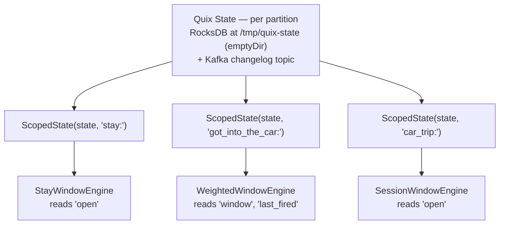

One shared store per entity, partitioned by a `<definition-name>:` key prefix. Engines use plain
keys (`"window"`, `"open"`) and stay ignorant of the sharing —
[`ScopedState`](../src/inference/engines/base.py#L42) is ten lines that prepend a prefix.

**State is ephemeral by design.** RocksDB sits on an `emptyDir`; the container root filesystem is
read-only. On restart or reschedule it rebuilds from the Kafka changelog. This is consistent with
the no-in-cluster-persistence rule (K8s is elastic disposable compute; everything durable is in
Aiven or Neon).

**Changelog cost is a real constraint.** Every `state.set` is a Kafka record. `geofence` writes
`inside` only on *change* for exactly this reason — a location stream samples every ~11 s, and an
unconditional write per ping per region definition is a lot of records carrying no information. (See
the honest accounting in the [geofence comment](../src/inference/engines/geofence.py#L87): `last_fix`
still writes per accepted fix, because the plausibility reference must be fresh to catch a 700 m/1 s
snap.)

### Why one shared router instead of one pipeline per definition

The Aiven free tier caps user topics at **5**. A per-definition branch would mint a changelog topic
*and* a repartition topic each — N definitions, 2N topics. The shared keyed router costs **1
repartition + 1 changelog regardless of definition count**. This is the constraint that made
"definitions as data through one router" not merely elegant but necessary (ADR 0004).

---

## 7. Enrichment: capabilities scale by addition

This is ADR 0001's enricher chain, re-established in a smaller and better shape. The old design was
an ordered pipeline of enrichers mutating a draft. The current one is a **registry of pure
derivers**, and the ordering that the old pipeline needed turned out to be unnecessary.

### What a capability is

A structured, *derivable* fact an event carries. **Presence is the capability** — if
`event.interval` is not `None`, the event spans time. It commits a consumer to nothing; it is a
latent affordance, sniffable structurally.

Two exist today:

- **`interval`** — this event has a start and an end.
- **`place`** — this event happened somewhere.

### The mechanism

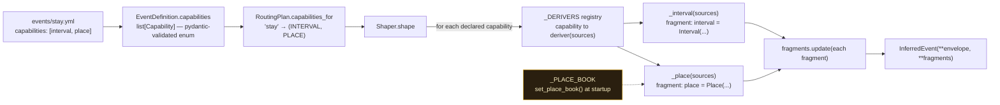

A deriver's contract is deliberately narrow:

```python
Callable[[list[dict]], dict]     # full source events → a fragment of InferredEvent fields
```

It returns a **fragment** — a partial dict of `InferredEvent` field names — which the shaper merges.
That is why order doesn't matter and why adding a capability requires no change to the shaper, the
router, or any engine:

1. add a member to `Capability`;
2. add the field to `InferredEvent`;
3. write a deriver and `@register_capability(...)` it;
4. list it in a definition's `capabilities:`.

`Shaper` never names a capability. It runs whatever the definition declared.

### Derivers operate on full source bodies, not lineage

`Decision.sources` carries the **whole source event records** as the engine consumed them, not the
trimmed `{id, name, timestamp}` projection. This is the deliberate design decision that makes the
seam useful: `_place` needs `message.lat`/`message.lon`, which the lineage projection does not
carry. A future `amount` capability (a spend event) will need `message.amount` the same way.

So `Shaper.shape` does two different things with the same input:

```python
fragments = {}
for capability in self._plan.capabilities_for[envelope["name"]]:
    fragments.update(derive_capability(capability, sources))     # reads the FULL bodies

event = InferredEvent(..., derived_from=[_lineage(s) for s in sources], **fragments)
#                                        ^ projects the SAME bodies down to provenance pointers
```

### `interval` — the extent of the evidence

```python
timestamps = [(s.get("message") or {})["timestamp"] for s in sources]
return {"interval": Interval(started_at=min(timestamps), ended_at=max(timestamps))}
```

A pure function of the evidence with no engine-specific knowledge — any event declaring `interval`
gets it the same way. `duration_seconds` is a pydantic `computed_field` on `Interval`, so it is
derived **once**, serializes into the JSON Schema, and appears in both the stored JSONB and the
generated TypeScript. Nothing downstream re-derives it and nothing can drift from it.

`ended_at` duplicates the envelope `timestamp` for spans. That redundancy is intentional: the
capability reads on its own without reaching back into the envelope.

### `place` — evidence plus reference data

Two facts of genuinely different kinds, deliberately in one capability:

| Field | Kind | Available when |
|---|---|---|
| `lat`, `lon` | centroid of the contributing fixes | always (if sources carry coordinates) |
| `spread_m` | distance to the furthest contributing fix | always |
| `label` | name of the known place containing the centroid | only if a POI row matched |
| `distance_m` | centroid → matched place centre | only if matched |
| `everyday` | is this the place you *live* in? | only if matched |

`spread_m` is the evidence's **self-reported precision** — not a GPS accuracy claim. A tight cluster
reads as a confident point; a loose one doesn't pretend otherwise.

`label = None` is a real and useful answer, not a failure: *"40 minutes somewhere at 47.195, 8.524"*
is the raw material for naming that place later. That is a discovery loop, as opposed to a
declare-everything-up-front one.

Matching is **nearest-wins containment** against each place's own `radius_m`, so a big district and
a small shop can coexist in one book and the shop wins:

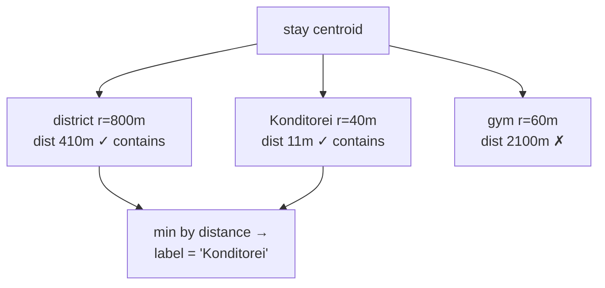

A malformed row (missing `lat`, non-numeric `radius_m`) is skipped inside the loop rather than
breaking shaping — [capabilities.py:100](../src/inference/capabilities.py#L100).

**The label is frozen at derive time.** Renaming or adding a place does not retroactively relabel
history; re-deriving from the retained raw fixes does (`scripts/rederive.py`). That is the deliberate
trade: events stay immutable facts about *what was known when they were minted*.

**`everyday`** is the interesting one. A stay at home is a real derived fact — persisted, queryable —
but it has no natural boundaries in the data: you are home for fourteen hours, iOS stops sampling,
and `max_gap_seconds` chops the cluster wherever the outage fell. The "visit" is an artifact of
sampling, not of behaviour. So the runtime stamps *what kind of place it is* and the dashboard
decides whether to draw it — which is what lets a "show everyday places" toggle exist without
re-deriving anything.

### The place book is a module-level global. On purpose.

```python
_PLACE_BOOK: list[dict] = []

def set_place_book(places: list[dict]) -> None: ...
```

A deriver's signature is `(sources) -> fragment` — there is no slot for reference data. So the
deriver stays a pure function of *(evidence, reference data)*, and the reference data is installed
**once, explicitly, by the composition root** ([quix.py:78](../src/inference/runtime/quix.py#L78)).
The core never reads Neon itself; it is handed the answer. `scripts/rederive.py` calls
`set_place_book` the same way, which is how a replay reproduces production labels exactly.

An empty book means no stay gets a label — a degraded mode, never an error.

---

## 8. Reference data: one table, two kinds

Places are data in Neon, not YAML. One `regions` table, and its `kind` column says what each row
is *for*:

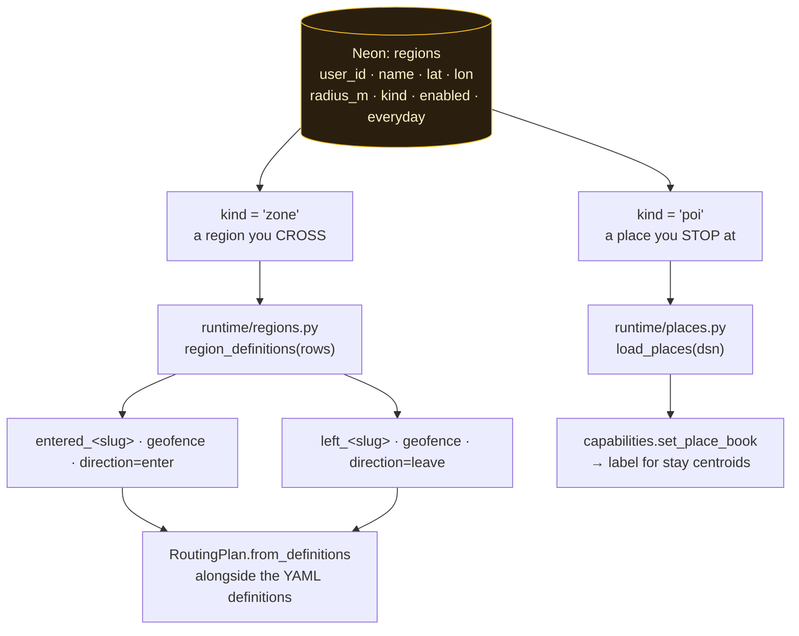

**One table** because both are "a named circle on the map" and both should be editable in one place
(the dashboard, eventually). **Two kinds** because the consumers must not overlap: a POI expanded
into a geofence would emit `entered_<slug>` events colliding with the names the OwnTracks lane
already produces, and would fire spurious edges for a radius far below what the sampling can resolve
(ADR 0007). Each query filters on `kind` explicitly.

The slug rule (`lowercase`, non-alnum runs → `_`, trim edges) must match the OwnTracks Vector lane,
so a region named "Home" yields `entered_home` / `left_home` either way.

**Both reads are best-effort.** `build_runtime` wraps each in `try/except Exception` + `logger.
exception`. A Neon blip degrades to "no region events" or "no place labels" until the next restart —
never a crash. This is the runtime's **only** Neon access, and it happens once at startup.

Editing a region or place takes effect on the next runtime start. Since state is ephemeral and
recovers from the changelog, a restart is cheap and safe.

---

## 9. The contract: schemaless at rest, typed in memory

Events are stored in a Neon JSONB column, so a new event type never needs a migration. But *stored
as a document* does not mean *structureless* — [`event.py`](../src/inference/event.py) is the
structure, and it is the single source of truth for a derived event's shape across two languages.

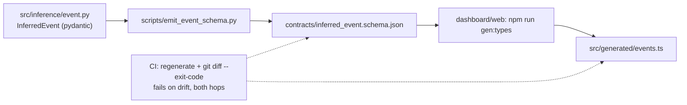

### What is modelled, and what isn't

`InferredEvent` models the **`message` payload** — the unit that is identical whether the event
arrives over Kafka or is read back out of JSONB. It deliberately does *not* model the transport
wrapper or the Neon row columns; those are shaping concerns owned by `Shaper` and Vector.

| Layer | Fields | Owned by |
|---|---|---|
| wrapper | `name`, `source_app`, `source_type`, `message` | `Shaper.shape` (derived) / Vector (raw) |
| envelope | `id`, `name`, `inference_type`, `user_id`, `timestamp`, `derived_from` | `InferredEvent` |
| capabilities | `interval?`, `place?` | `InferredEvent` + the deriver registry |
| row columns | `ingested_at`, … | Neon / Vector's persister |

`InferredEvent` is strict (`extra="forbid"`): derived events are wholly minted by the runtime, so
their shape is closed and worth enforcing. Raw producer events flow through the same JSONB column
but stay loosely typed — they are not modelled here.

`source_type` (`"kafka"` for derived, `"http_server"` for raw) records the entry mechanism. It is
metadata only; Vector's persister drops it and it never reaches Neon. Vector keys
`event_class=derived` off the *presence of* `message.inference_type`.

### Time

There is exactly one event-time: **`message.timestamp`**. "When the system handled it" is the
DB-set `ingested_at` column. The old wrapper produce-time `timestamp` and `message.processed_at`
(both ≈ `ingested_at`) were dropped as redundant.

Every engine sets `occurred_at` to the moment the pattern *completed* — the latest contributing
signal, or the last fix inside a cluster. This keeps lineage **monotonic**: a derived event's
timestamp is ≥ every contributor's, so nothing is ever stamped earlier than its own evidence.

### Deliberately absent

**Presentation / role** (span vs point vs hidden). That is a *view* decision — how one consumer
chooses to surface an event — not an intrinsic fact about it. `car_trip` and `phone_is_charging`
both carry `interval`; only the dashboard decides one is drawn as a span. Role lives in the
dashboard's `SPAN_EVENTS`, never in this model.

**A confidence score.** Removed, which resolves ADR 0002's open question. It existed for weighted
composition across derivation hops, and that never happened, because trust ended up declared *per
consumer* instead: a weight map says how much *this* derivation trusts a given signal — and it
should, since the same signal is not equally trustworthy to every consumer (the direction-ambiguous
car lock is worth 4 to `got_into_the_car` and 5 to `got_out_the_car`). With trust living in the
consumer's config, a scalar riding on the event is redundant. It was also never comparable: engines
emitted unbounded definition-local weight sums, hardcoded `1.0`s, and in one case a count of GPS
fixes, all under one field name. The score survives where it is meaningful — `Decision.score`,
logged when an event fires ("fired at 12 against a threshold of 10"), invaluable when tuning a
weight map, and never part of the data model.

---

## 10. Module reference

### `runtime/config.py`

Pure constants plus env-backed settings. Required values are read **lazily via functions** so the
module (and `runtime/quix.py`) imports without a full environment — which is what lets tests import
the adapter's neighbours freely.

| Name | Kind | Default | Notes |
|---|---|---|---|
| `APP_NAME` | constant | `"inference"` | emitted as `source_app` on every derived event |
| `EVENTS_DIR` | env `EVENTS_DIR` | `events` | override to point a replay at a candidate definition set |
| `CONSUMER_GROUP` | env `QUIX_CONSUMER_GROUP` | `inference-quix-runtime-v2` | bumped v1→v2 when engine state format changed; a fresh group = fresh changelog = self-healing state |
| `STATE_DIR` | env `QUIX_STATE_DIR` | `state` | `/tmp/quix-state` in the image (emptyDir) |
| `kafka_bootstrap()` | env, **required** | — | raises `KeyError` if unset |
| `neon_dsn()` | env, optional | `None` | unset → regions and places both off |
| `kafka_ssl()` | env | `/etc/kafka/ssl/*.pem` | librdkafka mTLS; paths match the Secret volume mount |

### `runtime/definition.py`

`EventDefinition` — an inference event expressed as data. `extra="forbid"`, so a typo'd key is a
validation error rather than a silently ignored field.

| Field | Type | Default | Meaning |
|---|---|---|---|
| `name` | `str` | required | **identity.** The emitted event name, the sink-routing key, and the state scope prefix |
| `enabled` | `bool` | `True` | skip-load toggle for quick experiments |
| `engine` | `str` | required | engine type, resolved against the registry |
| `engine_config` | `dict` | `{}` | engine-specific; **the engine parses it**, the runtime never knows its schema |
| `source_topic` | `str` | required | the external topic contributors arrive on |
| `sink_topic` | `str` | required | where the derived event is produced |
| `capabilities` | `list[Capability]` | `[]` | structured facts to derive from the evidence |

`load_definitions(events_dir)` globs `*.yml` in filename order. **Best-effort and isolated**: a
malformed or disabled definition is logged and skipped, never fatal to the others — one bad
experiment can't take the fleet down.

> **Identity, precisely.** The definition `name` is the emitted `message.name`. The emitted
> `message.inference_type` is the **engine type** (`weighted_window`), *not* the name. Getting these
> two confused is the single most common misreading of this codebase.

### `runtime/core.py`

**`StateStore`** (Protocol) — `get(key, default)` / `set(key, value)`. The state port.

**`Consumer`** (NamedTuple) — `(produces: str, engine: Engine)`. An engine bound to the event it
produces. `engine.name` is the engine *type*; `produces` is the definition name.

**`RoutingPlan`** (frozen dataclass) — everything the adapter needs, computed once from the YAML and
transport-agnostic. One cohesive value rather than a bag of loose maps.

| Member | Type | Meaning |
|---|---|---|
| `consumers` | `dict[str, list[Consumer]]` | input event name → consumers that fire on it. **A name absent here is terminal and stops a cascade.** |
| `sink_for` | `dict[str, str]` | produced event name → sink topic |
| `source_topic` | `str` | the single external source |
| `capabilities_for` | `dict[str, tuple[Capability, ...]]` | produced name → capabilities; used by `Shaper`, kept out of routing |
| `sink_topics` | `set[str]` (property) | a *derived view* over `sink_for` — not separate state to keep in sync |
| `from_definitions(defs)` | classmethod | resolves engines, builds all four maps, enforces the one-source rule |

The one-source rule: `external = declared_sources - set(sink_for.values())`, and `len(external) != 1`
raises. Recursion is in-process so a second source is never needed, and multi-source `concat` stalls
under `auto_offset_reset=latest` — a genuinely separate feed must be merged at ingest (Vector).

**`Router`** — the plan plus the behaviour that runs it. `key_for` (static), `route`, and the three
pass-through properties an adapter needs. Transport-agnostic: it holds topic *names* and the consumer
graph only; per-entity state flows in per call, so one `Router` is shared across all keys.

**`Shaper`** — `shape(item) -> dict`. Stateless. Derives declared capabilities, projects lineage,
mints the `InferredEvent` and the wrapper.

**`_lineage(source) -> Contributor`** — projects a full source event down to `{id, name, timestamp}`.
The trimmed provenance pointer we persist, explicitly distinct from the full body capabilities are
derived from.

### `runtime/quix.py`

The composition root, and the only file that imports `quixstreams`.

`build_runtime()` in order: load YAML definitions → (best-effort) append Neon region definitions →
(best-effort) install the place book → build the `RoutingPlan` → construct `Router` + `Shaper` → log
the loaded set → construct the `Application` (`auto_offset_reset="latest"`, mTLS on both consumer and
producer, `state_dir`) → `_wire_topology`. `run()` is `build_runtime().run()`.

Note the ordering dependency: `set_place_book` must happen before any event is shaped, which is why
it is here rather than lazily inside the deriver.

### `runtime/regions.py`

`region_definitions(rows)` is **pure** — plain dicts in, `EventDefinition`s out, unit-testable with
no database. Two definitions per region (`enter` + `leave`). A row with a blank name/slug is logged
and skipped. `load_region_definitions(dsn)` is the impure wrapper: no DSN → feature off; psycopg
imported lazily; filters `enabled = true AND kind = 'zone'`.

### `runtime/places.py`

`load_places(dsn)` → `[{name, lat, lon, radius_m, everyday}]`, filtered `enabled = true AND kind =
'poi'`. Same lazy-psycopg rule. No DSN → no labels.

### `geo.py`

| Function | Purpose |
|---|---|
| `haversine_m(lat1, lon1, lat2, lon2)` | great-circle distance in metres |
| `implied_speed_kmh(dist_m, dt_s)` | `dt ≤ 0` → `inf`, except a true zero-distance repeat → `0.0` |
| `is_implausible_jump(prev…, new…, max_speed_kmh)` | `True` if the transition needs impossible speed |
| `DEFAULT_MAX_SPEED_KMH = 400.0` | well above any ground travel, low enough to catch a wifi-positioning snap |

Extracted from `geofence.py` when `stay_window` appeared: distance and plausibility are properties
of *location data*, not of either strategy, and both engines must agree on them.

The guard exists because of a specific real failure (2026-07-25 09:32): two consecutive fixes 1 s
and 700 m apart — implying ~2.5 M km/h — where the bad fix claimed `acc: 5` while sitting on the
phone's home coordinates as the car drove away. **Reported accuracy is not a safety net.** The check
is deliberately one-sided: it judges the new point against the last *accepted* one, so a single bad
fix is skipped and the track continues from the last trustworthy position.

### `engines/base.py`

**`Decision`** (frozen dataclass) — `occurred_at: float`, `score: float`, `sources: tuple[dict, ...]`.

**`ScopedState`** — prefixes keys with `<definition-name>:`.

**`Engine`** (runtime-checkable Protocol) — `name: str`, `input_event_names() -> set[str]`,
`decide(event, state) -> Decision | None`.

**Registry** — `@register_engine("<type>")` records the class *and stamps the type onto it as
`cls.name`*, so `engine.name == "weighted_window"`. `build_engine(definition)` looks up
`definition.engine` and constructs `cls(config=definition.engine_config)`; an unknown engine raises
`RuntimeError` listing the registered ones. Registration happens as an import side-effect of
`inference/engines/__init__.py`.

> **Asymmetry worth knowing.** A *malformed* definition is skipped at load (best-effort, isolated).
> An *unknown engine name* is fatal at startup (fail-fast, before any traffic). Both are the right
> behaviour for their moment: the first protects unrelated definitions from one bad experiment; the
> second refuses to run a fleet that silently isn't doing what you declared.

---

## 11. Engine reference

Seven engines are registered; the six distinct strategies are grouped below
(`validated_session_window` subclasses the pairing one and is documented with it). All share the
shape `(event, scoped state) -> Decision | None`, and all are selected purely by a definition's
`engine:` string.

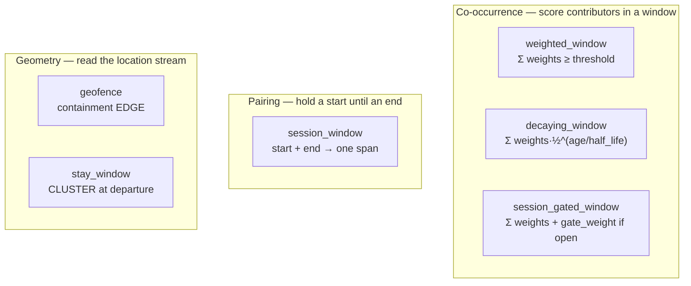

### Shared window semantics — and the differences that matter

| | `weighted_window` | `decaying_window` | `session_gated_window` |
|---|---|---|---|
| Per-contributor sighting kept | **earliest** | **latest** | **latest** |
| Weight fades with age | no | yes (`half_life_seconds`) | no |
| Window reset on fire | **no** (cooldown only) | **no** (cooldown only) | **yes** (window + gate cleared) |
| Standing latch | — | — | yes (`gate_event`) |
| Score | `Σ weights[present]` | `Σ weights·0.5^(age/half_life)` | `Σ weights[present] (+ gate_weight)` |

The earliest-vs-latest difference is not cosmetic. `weighted_window` keeping the earliest sighting
and never resetting after a fire is exactly why it would mis-pair sequential sessions — which is why
`session_window` and `session_gated_window` are separate strategies rather than options on one.

### `weighted_window`

Fires when distinct contributing event types seen within a window sum by weight to a threshold, then
holds off for a cooldown.

| Config | Required | Default | Meaning |
|---|---|---|---|
| `weights` | — | `{}` | event name → weight. **Also defines `input_event_names()`** |
| `threshold` | ✓ | — | fire when the sum reaches this |
| `window_seconds` | ✓ | — | contributors older than this are pruned |
| `cooldown_seconds` | — | `1800` | minimum event-time gap between fires |
| `max_age_seconds` | — | `{}` | `{name: seconds}` — per-contributor freshness cap, overriding `window_seconds` for that name only. **`weighted_window` only** — see below |

State: `window = {name: {ts, event}}`, `last_fired`. Event-time: `max(contributor ts)` — the moment
the pattern completed and the inference first became knowable. Lineage: every contributor in the
window at fire time.

Live example — `got_into_the_car` (threshold 11, 600 s window): `device_connected_to_power` 6,
`device_connected_to_carplay` 5, `car_lock_state_change` 4, `car_driver_door_opened` 4. Note that no
single signal fires it, and the weights encode *directional trustworthiness*: a CarPlay connect only
happens at entry, while a lock change fires at both entry and exit.

#### `max_age_seconds` — a contributor's *second* role

A contributor does two things, and the weight map can only speak about one. It adds weight, and while
it sits in the window it **keeps the whole pattern completable**. For a signal that repeats on its own
schedule the second role is the harmful one, and no weight can address it.

`device_connected_to_power` (the wireless charger) re-seats every few minutes while driving, so a
mid-drive re-seat is still in `got_into_the_car`'s 600 s window at the **arrival**, where the
walk-away lock and the exit door then complete an *entry*. On 2026-07-24 that minted
`got_into@07:47:05` fifteen seconds *after* a correct `got_out@07:46:50`, and the phantom entry stayed
open until a door at 12:02:58 — a 4 h 16 m "trip". Displacement cannot refute it: the phone really did
move over that span, so the bounding box is large. This is the phantom class that survived every
weight candidate of 2026-07-28/29 (ADR 0009), because it is not a weighting failure.

Capping freshness separates the two roles — the charger still anchors an entry when it is the thing
that just happened, and stops carrying the pattern minutes later. Unlike a weight this is not a
preference but a claim about how long a particular signal remains evidence of anything. Measured over
30 d / 86 drives on what `car_trip` actually emits: phantom trips 7 → 4, fabricated trip-time
9.19 h → 2.06 h, with matched drives 68/86, duration error 129 s and `drives_missed` 2/86 all
unchanged; monotone in the cap (30 s → 1.65 h, 300 s → 7.91 h), so it tracks the mechanism rather than
fitting the sample. Issue #35, `scripts/backtest_candidates/charger_freshness_60.yml`.

It is deliberately **not** offered on `session_gated_window`: measured a no-op there, because that
engine keeps the *latest* sighting and its window is 300 s. The mechanism needs keep-earliest **plus**
a long window **plus** a signal that repeats on its own schedule.

> **Necessity is the one thing this map still cannot express**, and it was measured and not adopted
> (2026-07-31, issue #35). `got_out_the_car` fires on `car_driver_door_opened + car_lock_state_change`
> — two direction-ambiguous signals summing to exactly the threshold (5+5=10) at walk-away, 19 times
> in 30 d. Raising the threshold to 11 cannot forbid *that* subset without equally forbidding the
> gated single-signal path ADR 0005 exists to provide (CarPlay-disconnect 6 + gate 4 = 10). An
> explicit at-least-one-of veto can, but scored worse: 3 matched drives lost for 2.9 h of phantom
> span. And in `session_gated_window` a veto **defers rather than deletes** — the latch is consumed
> and the cooldown starts only *on fire*, so 9 of the 19 suppressed firings simply re-fired minutes
> later with a peripheral attached. Reason about suppression there against the state machine, not as
> arithmetic on the firing count.

### `decaying_window`

Same shape, but a contributor's weight fades with age inside the window: two signals fire the
inference only if they land *close in time*. `half_life_seconds` (default `window_seconds / 2`) tunes
how tight that coupling is. Negative age (out-of-order arrival) is clamped to "fresh". Not currently
used by any definition.

### `session_window`

Pairs a start with the next end into one span. Doesn't score anything.

| Config | Required | Default |
|---|---|---|
| `start_event` | ✓ | — |
| `end_event` | ✓ | — |
| `max_duration_seconds` | — | `21600` (6 h) |

State: `open = {ts, event}`. On start: stash (latest wins). On end: if no open start, nothing fires;
otherwise the start is **consumed either way**, and the pair is emitted unless the gap exceeded
`max_duration_seconds`. Event-time: the later of the two. Lineage: `(start, end)` in that order, so
a declared `interval` spans exactly the session.

Live: `phone_is_charging` (`device_connected_to_power` → `device_disconnected_from_power`, 24 h max).
`car_trip` uses the validated subclass below.

> **Pairing is by name only.** This is why the OwnTracks/geofence lanes emit zone-specific names
> (`entered_gym`, not `entered` with a payload field) — a session engine has no way to match on
> anything else.

### `validated_session_window` (issue #23 P1)

`session_window` plus a **displacement guardrail**: while the session is open it folds the raw
`location_ping` stream into a running bounding box, and refuses to emit a session the entity
demonstrably did not move over. Subclasses `session_window`, so all of the above still holds; it
only adds a veto.

Why it exists: the detectors on both ends of `car_trip` are direction-ambiguous, so they can fire
on the wrong side of a boundary and hand the session engine a **time-inverted** trip. On
2026-07-27 that produced `car_trip [11:58:19 → 12:13:37]` — a 15-minute "drive" across a span the
phone was parked at a vet. Plain `session_window` has no way to notice. Displacement is the one
check that needs no tuning: it is a physical fact, not a threshold over noisy evidence.

| Config | Required | Default |
|---|---|---|
| `start_event`, `end_event`, `max_duration_seconds` | (inherited) | — / — / `21600` |
| `min_displacement_m` | — | `300` |
| `min_fixes` | — | `3` |
| `min_coverage_ratio` | — | `0.5` |
| `max_accuracy_m` | — | `100` |
| `max_speed_kmh` | — | `400` (`geo.DEFAULT_MAX_SPEED_KMH`) |
| `location_event` | — | `location_ping` |

`input_event_names()` is `{start, end, location_event}` — the only engine that consumes both
derived events and a raw stream.

**Extent, not net displacement.** The metric is the bounding box diagonal, not first-fix-to-last:
a drive that returns to where it started has ~zero net displacement and is still a drive.

**Abstain and reject are asymmetric on purpose.** Sparse GPS is absence of evidence, not evidence
of a phantom, so anything short of a confident refutation emits:

| Condition | Verdict |
|---|---|
| fewer than `min_fixes` accepted fixes | abstain (emit) |
| accepted fixes span < `min_coverage_ratio` of the session | abstain (emit) |
| extent ≥ `min_displacement_m` | emit |
| extent < `min_displacement_m` | **suppress**, logged as `SUPPRESSED` |

A dropped real trip is worse than a phantom — a phantom is visible and correctable, a silent
omission is neither. Measured over 9 days / 1990 real raw events: 19 abstain, 6 accept, 1 reject,
and every abstain is in the pre-Overland sparse-GPS era (from 07-25 on, every session gets a real
verdict). Real trips measured 1237–5674 m; the phantom measured 24 m.

**Three filters guard the ACCEPT direction, which is the dangerous one** — one bad fix inflates
the box and waves a phantom through:

1. `max_accuracy_m` — a vague fix can't widen the box.
2. `is_implausible_jump` — the motivating real fix reported `acc: 5` while sitting 700 m away,
   which would clear any sane `min_displacement_m`. Reported accuracy is not a safety net.
3. **Event-time clamp** — a fix whose timestamp predates the session is dropped even though it
   arrived during it. Routing order is *arrival* order (`ingested_at`), not event order, so a
   batched producer routinely delivers an old fix mid-session. Caught in replay: on the
   2026-07-19 13:20 trip a single fix dated 11:26:44 pushed `n` from 2 past `min_fixes` **and**
   stretched coverage to 9.23, so both abstain guards fell at once and a real trip was
   suppressed on a box that actually measured two hours of sitting at home.

Out-of-order fixes (older than the last accepted one) are skipped, because the plausibility guard
is sequential. That is lossy — the replay accepts ~22 of the ~56 fixes SQL finds in a trip span —
but it biases `n` and coverage *downward*, i.e. toward abstaining, which is the safe direction.
Measured extents were unaffected (margins are 4–12×).

**The fixes are not lineage.** `sources` stays `(start, end)`, because the `interval` capability
projects the span from the lineage extent — folding fixes in would rewrite `started_at`/`ended_at`
to the fix range and corrupt the very span being validated. So the tracker keeps a bounding box
(10 floats, O(1)), unlike `stay_window`, which must retain fix bodies because there the fixes
*are* the lineage.

A suppressed session is still consumed, and `got_into_the_car` / `got_out_the_car` are emitted
independently — only the unsupported span is withheld. The raws are retained, so
`scripts/rederive.py` can rebuild the trip if the rule is later found wrong.

Live: `car_trip` (`got_into_the_car` → `got_out_the_car`, `min_displacement_m: 300`).

### `session_gated_window` (ADR 0005)

A weighted window plus a **latched gate**. The insight: when a derived event depends on a start then
an end, *the start is standing evidence for the end* — if you got into the car, at some point you
will get out. That evidence is a latch rather than a windowed signal, because start and end are
minutes to hours apart, far outside any co-occurrence window.

```
score = Σ weights[present windowed signals]  (+ gate_weight if a session is open)
fire  ⟺  score ≥ threshold
```

| Config | Required | Default | Meaning |
|---|---|---|---|
| `gate_event` | ✓ | — | latches "a session is in progress" |
| `gate_weight` | ✓ | — | bonus while the latch is valid |
| `max_open_seconds` | — | `21600` | a latch older than this is stale and dropped |
| `window_seconds` | ✓ | — | windowed-signal pruning |
| `threshold` | ✓ | — | |
| `weights` | — | `{}` | the windowed signals |
| `cooldown_seconds` | — | `1800` | |

Three safety properties, all structural:

1. **The gate cannot fire on its own.** Scoring only runs when a *windowed* signal arrives, and
   `gate_weight < threshold`. At least one real signal is always required.
2. **The latch is consumed on fire**, so sequential sessions can't reuse it.
3. **A stale latch is dropped** rather than left to validate a much later signal.

Tuning is the whole game (ADR 0005). Give a trustworthy signal enough weight that
`signal + gate_weight ≥ threshold`, but keep ambiguous or noisy signals *below* that, so
`noisy + gate_weight < threshold`. Live `got_out_the_car`: threshold 10, gate 4 —
`device_disconnected_from_carplay` 6 fires with the gate (6+4=10 ✓), while
`car_lock_state_change` 5 and `device_disconnected_from_power` 5 do not (5+4=9 ✗). That is deliberate:
it guards against a lock change right after entry and a mid-drive charger unplug, both of which would
otherwise close a trip that hadn't happened.

Lineage is the windowed signals only — the gate is *contextual* evidence, not lineage. The
start→end relationship is captured downstream by the `session_window` that pairs this event with its
start.

> **Gotcha — in this engine, suppressing a firing is a deferral, not a deletion.** The latch is
> consumed and the cooldown starts *only on fire*, so a suppressed pattern leaves the window, the
> latch and the cooldown untouched and fires as soon as one more contributor lands. Measured on 30 d
> of real signals, vetoing the ambiguous `door+lock` exits suppressed 19 firings and **9 of them
> simply re-fired** minutes later with a peripheral attached (issue #35). See §11's
> `max_age_seconds` note.

### `geofence`

Server-side geofencing: turns the raw `location_ping` stream into region enter/leave events, moving
the decision off the phone (where iOS region config is fragile — it is wiped whenever the OwnTracks
mode or endpoint changes) and onto the server, where regions are just data.

| Config | Required | Default | Meaning |
|---|---|---|---|
| `lat`, `lon`, `radius_m` | ✓ | — | the circle |
| `direction` | ✓ | — | `enter` \| `leave`; anything else raises at construction |
| `owner` | — | `None` | geofences are per-user; a point only tests against its owner's regions |
| `max_accuracy_m` | — | `radius_m` | a fix vaguer than the region tells you nothing about it |
| `max_speed_kmh` | — | `400` | plausibility guard |

Consumes `location_ping` only. State: `inside` (bool, **written only on change**), `last_fix`. Fires
on the containment edge — one definition per (region, direction), so a steady stream of pings inside
a region emits exactly one `entered_*`. Event-time: the ping. Lineage: the single triggering fix.

Gate order matters: owner → coordinates present → accuracy → plausibility → containment. A rejected
fix returns before touching `inside`.

Known limitations, both deliberate: no dwell/hysteresis (boundary jitter can still flap), and a
stream is coarser than CLRegion monitoring (entry time approximate, a brief in-and-out can be
missed).

### `stay_window` (ADR 0007)

Dwell detection by **clustering**, and the answer to `geofence`'s structural limit. An edge detector
needs a sample on each side of a boundary — but standing inside a shop produces no fixes at all (iOS
stops sampling, the producer's min-distance filter suppresses the rest), so a 40 m circle can receive
**zero** points and never fire. Clustering degrades a stay's *precision* with sparse data instead of
erasing its existence: one fix during a 40-minute gap in movement still says you were there.

| Config | Default | Meaning |
|---|---|---|
| `radius_m` | `60` | a fix within this of the running centroid joins the cluster |
| `min_dwell_seconds` | `300` | shorter than this, you were passing through |
| `max_accuracy_m` | `100` | vaguer fixes are dropped without touching the cluster |
| `max_gap_seconds` | `3600` | a sampling outage longer than this ends the cluster wherever the next fix lands |
| `max_speed_kmh` | `400` | plausibility guard |

State: one `open` cluster — `{clat, clon, n, first_ts, last_ts, last_lat, last_lon, events}`. The
centroid is a **running mean** (`clat += (lat - clat) / n`), so it is O(1) in state size; the
retained `events` list is what grows, and it is needed for lineage and capability derivation.

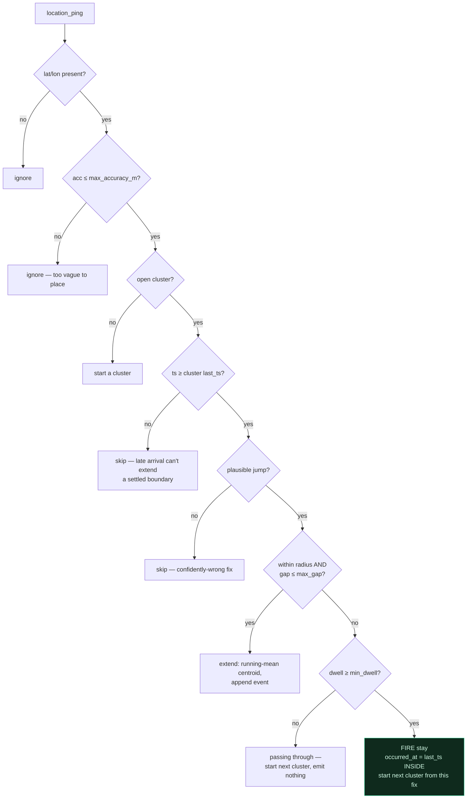

**Emission is at departure**, because a stay can only be known to have ended once a fix lands
outside it. So `occurred_at` is the last fix *inside* the cluster — the true end — not the fix that
broke it, and that breaking fix is **not** in the lineage: it starts the next cluster.

Out-of-order arrival is real and handled explicitly: batched producers flush a queue after a delay
(a fix 714 s late, delivered *after* newer ones, observed 2026-07-25). Clustering is sequential, so
a fix older than the cluster's end can't extend it — skipping is correct, corrupting the centroid is
not.

Measured on real Overland history (2026-07-25), radius 60 m / dwell 300 s produced exactly two stays
for the day — 96.8 min at a shop (47 fixes) and 27.7 min at home (16 fixes, centroid 10 m off) —
while the 13-minute drive between them fragmented into ~35 singleton clusters that correctly produced
nothing. Those are the numbers the defaults come from, not guesses.

Two deliberate omissions keep this a *strategy* rather than a policy: no POI naming (the event is a
generic `stay` carrying its centroid; labelling happens in the `place` capability), and no re-opening
of a closed stay if you return (that is a second stay, correctly).

### The retired seventh

`naive_bayes_window` was removed 2026-07-27. `car_door_closed` was its only consumer, gone since ADR
0005, and its one distinguishing feature — emitting a *calibrated posterior* rather than an arbitrary
sum — lost its point when `confidence_score` left the data model, since a score is now
detection-local and never emitted. It lives in git history.

---

## 12. Capability reference

| | `interval` | `place` |
|---|---|---|
| Enum member | `Capability.INTERVAL` | `Capability.PLACE` |
| Model | `Interval(started_at, ended_at, +duration_seconds)` | `Place(lat, lon, spread_m, label?, distance_m?, everyday?)` |
| Derived from | source `message.timestamp` values | source `message.lat`/`lon` + the place book |
| Needs reference data | no | yes (degrades to `label=None`) |
| Yields no fragment when | never (assumes non-empty sources) | no source carries coordinates |
| Declared by | `car_trip`, `phone_is_charging`, `stay` | `stay` |

`derive_capability(capability, sources)` raises `RuntimeError` listing the registered capabilities if
a declared one has no deriver. Since `Capability` is a pydantic-validated enum, a YAML *typo* is
caught at definition load (that definition is skipped); an enum member added without a deriver fails
later, at shape time, per event.

`place_book()` returns a read-only copy of the installed book — for diagnostics and tests.

---

## 13. State key layout

All keys are prefixed `<definition-name>:` by `ScopedState`, so the real RocksDB keys for today's
definitions are:

| Engine | Key | Value | Written |
|---|---|---|---|
| `weighted_window` | `window` | `{name: {ts, event}}` (earliest per name) | every contributor |
| | `last_fired` | `int` | on fire |
| `decaying_window` | `window` | `{name: {ts, event}}` (latest per name) | every contributor |
| | `last_fired` | `int` | on fire |
| `session_window` | `open` | `{ts, event}` or `None` | on start; cleared on end |
| `validated_session_window` | `open` | `{ts, event}` or `None` | (inherited) |
| | `track` | `{n, la0, la1, lo0, lo1, f0, f1, lat, lon, ts}` — bounding box, O(1) | every accepted in-session fix; cleared on start and on end |
| `session_gated_window` | `window` | `{name: {ts, event}}` (latest per name) | every contributor; **cleared on fire** |
| | `open` | `{ts, event}` or `None` | on gate; cleared on fire or when stale |
| | `last_fired` | `int` | on fire |
| `geofence` | `inside` | `bool` | **only on change** |
| | `last_fix` | `{lat, lon, ts}` | every accepted fix |
| `stay_window` | `open` | `{clat, clon, n, first_ts, last_ts, last_lat, last_lon, events}` | every accepted fix |

Concretely, for the current definition set: `stay:open`, `got_into_the_car:window`,
`got_into_the_car:last_fired`, `got_out_the_car:window`, `got_out_the_car:open`,
`got_out_the_car:last_fired`, `car_trip:open`, `car_trip:track`, `phone_is_charging:open`,
`entered_home:inside`, `entered_home:last_fix`, …

Everything stored must be JSON-serializable — Quix `State` round-trips values through the changelog.
This is why engines stash full event **dicts** rather than model instances.

---

## 14. Failure modes

What breaks, how loudly, and whether it takes the runtime down.

| Situation | Behaviour | Fatal? |
|---|---|---|
| Malformed / invalid `events/*.yml` | logged `error`, that definition skipped | no |
| `enabled: false` | logged `info`, skipped | no |
| No enabled definitions at all | `RuntimeError` | **yes, at startup** |
| Unknown `engine:` string | `RuntimeError` listing registered engines | **yes, at startup** |
| Invalid `direction` for a geofence | `ValueError` at engine construction | **yes, at startup** |
| Zero or 2+ external source topics | `RuntimeError` with the ADR 0004 explanation | **yes, at startup** |
| `KAFKA_BOOTSTRAP_SERVERS` unset | `KeyError` | **yes, at startup** |
| Neon unreachable at startup | `logger.exception`, continue without regions and/or place labels | no |
| `NEON_DATABASE_URL` unset | `info` log, both features off | no |
| Event has no `message.user_id` | `warning`, bucketed under `_no_user_id` | no |
| Non-dict event | `route` returns `[]` | no |
| Source event missing `message.id` | **`KeyError` in `_lineage`** — shaping crashes | per-event |
| Declared capability with no deriver | `RuntimeError` at shape time | per-event |
| Malformed row in the place book | skipped inside the match loop | no |
| Event with no coordinates but `place` declared | no `place` fragment (silent no-op) | no |
| `validated_session_window` session with no displacement | `info` log `SUPPRESSED`, no event emitted (the pair still fires) | no |
| `validated_session_window` with sparse/absent fixes | abstains — the session is emitted unvalidated | no |
| RocksDB state lost (pod reschedule) | rebuilt from the Kafka changelog | no |

The pattern: **anything wrong with the declared configuration is fatal before traffic flows;
anything wrong with external reference data degrades; anything wrong with a single event is
isolated.** The one rough edge is `_lineage`'s `msg["id"]` — Vector mints ids for all raw events, so
this only bites a hand-injected or misconfigured producer, but it does so as a crash rather than a
skip.

---

## 15. Recipes

### Add an inference event

1. Write `events/<name>.yml`: `name`, `engine`, `engine_config`, `source_topic`, `sink_topic`,
   optional `capabilities`.
2. That's it. The runtime loads it on next start — no new directory, consumer, image, or ArgoCD app.

Before touching a weight map or threshold, **replay real history first**:

```bash
# WHAT changed
NEON_DATABASE_URL=… uv run python scripts/backtest.py --days 25 --candidate cand.yml --focus car_trip
# whether it got BETTER (junk_trips = sub-2-min phantoms, drives_missed = real drives lost)
NEON_DATABASE_URL=… uv run python scripts/trip_eval.py --days 25 [-v] [cand.yml …]
```

A new signal is a trigger to reconsider **every** contributor, not to append one. It can make a
failure path unreachable *and* create new ones. Judge a signal on noise and ambiguity, not presence;
adjudicate with `trip_eval`, never a count delta.

### Add an engine (a new strategy)

1. New class in `src/inference/engines/<name>.py` implementing `input_event_names()` + `decide()`.
2. `@register_engine("<name>")`.
3. Import it in `engines/__init__.py` (registration is an import side-effect).
4. `engine: <name>` in a definition.

No runtime change. Parse your own `engine_config` in `__init__` — the runtime never knows its schema.
Keep the module import-clean, and put any geometry in `geo.py` if a second engine could need it.

### Add a capability (extend enrichment)

1. `Capability.<NAME> = "<name>"` in `event.py`.
2. A pydantic model for its payload, if it needs one.
3. The optional field on `InferredEvent`.
4. A deriver in `capabilities.py` + `@register_capability(Capability.<NAME>)`.
5. `capabilities: [<name>]` in the definitions that should carry it.
6. Regenerate the contract, or CI fails:
   ```bash
   uv run python scripts/emit_event_schema.py     # → contracts/inferred_event.schema.json
   (cd dashboard/web && npm run gen:types)        # → src/generated/events.ts
   ```

Remember the constraint from §4: your deriver only sees what the *engine* consumed. If it needs raw
message fields, it only works on definitions fed by raw events.

If it needs reference data, follow the `place` pattern: load it in a `runtime/` module with lazy
psycopg, install it from `build_runtime` with a `set_*` function, keep the deriver a pure function of
(evidence, reference data). **Never fetch from inside the core.**

### Rebuild derived history after a change

A stream processor derives forward only — a new engine can't see the past, and a `place` label is
frozen at mint time. Derived events are a *cache*; the raw signals are the source of truth.

```bash
(cd workers && NEON_DATABASE_URL=… uv run python ../scripts/rederive.py \
    --since '2026-07-25 00:00' --only stay --events-dir $PWD/../events [--produce])
```

Dry-run by default. `--only` is **required**, because every definition fires during a replay and most
already exist in Neon from the live runtime — producing them all would duplicate history rather than
repair it.

### Run and test locally

```bash
cd workers/runtime && python quix_main.py    # loads workers/.env via find_dotenv(usecwd=True)
uv run ruff check . && uv run pytest         # tests exercise the core in-memory, no Kafka
```

`find_dotenv(usecwd=True)` walks *upward* from the CWD, so you must run from inside the `workers/`
tree for `workers/.env` to be found. In K8s the same vars come from the ConfigMap and Secret, and
`find_dotenv` returns `""` and is skipped.

---

## 16. Gotchas

- **`name` vs `inference_type`.** `message.name` is the definition name; `message.inference_type` is
  the engine type. Neither is the other.
- **A derived event looks different in-process than on Kafka.** Recursion sees a thin envelope
  (`id`, `name`, `inference_type`, `user_id`, `timestamp`). Kafka gets lineage and capabilities. An
  engine can never depend on an upstream event's lineage or capabilities.
- **`place` needs raw geo sources.** Declaring it on a definition whose contributors are derived
  events silently yields nothing.
- **Weighted windows don't reset on fire.** Only `last_fired` is set. The cooldown is what prevents
  re-firing, not an emptied window — which is why they'd mis-pair sequential sessions and why the
  session engines exist.
- **The gate is not lineage.** `session_gated_window` deliberately omits `gate_event` from
  `Decision.sources`; the start→end link is captured by the `car_trip` `session_window` instead.
- **`session_window` consumes the open start even when it rejects the pair.** A stale start does not
  linger to be matched by a later end.
- **The breaking fix is not part of a stay.** It starts the next cluster.
- **Every `state.set` is a Kafka record.** Think about write frequency in a `decide` that runs on a
  location stream.
- **Region and place edits need a restart.** Both are read once at startup.
- **Definitions are baked into the image.** `EVENTS_DIR` points at a directory in the container; a
  YAML change ships through the normal build/deploy cycle.
- **Reported GPS accuracy is not a safety net.** A fix claiming `acc: 5` was 700 m wrong. That is why
  `is_implausible_jump` exists alongside the accuracy gate.
- **Consumer-group bumps are a state reset.** `CONSUMER_GROUP` was bumped v1→v2 when the engine state
  format changed; a fresh group means a fresh changelog, which is the cheap way to migrate state
  formats. The old changelog is orphaned (harmless, but it occupies one of five topic slots).
- **Only one external source topic is allowed**, and the error message explains why. Merge separate
  feeds at ingest, in Vector.
