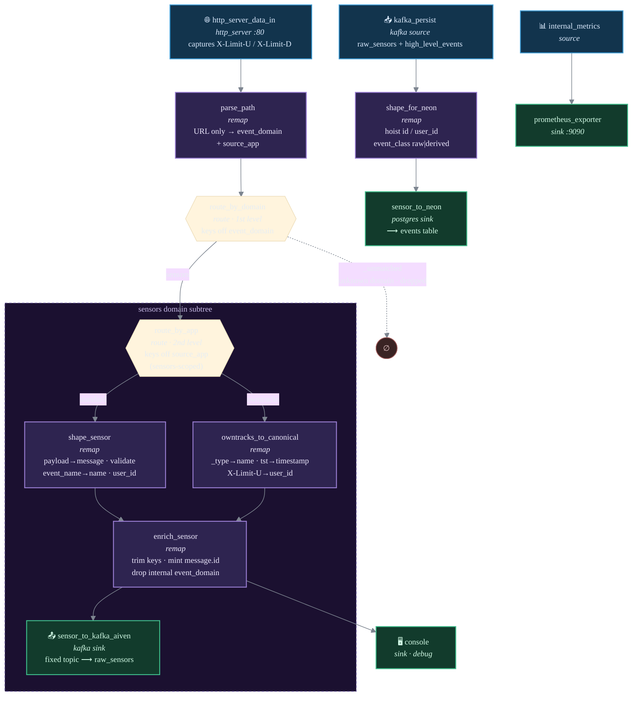

# Vector pipeline — ingest gateway + Neon persister

> **Current truth for Vector.** This documents the live Vector configuration under
> [`deploy/vector/kustomize/base/configs/`](../deploy/vector/kustomize/base/configs/).
> Vector is no longer in the emit path (the Quix runtime produces derived events
> straight to Kafka — see [ADR 0004](adr/0004-scaling-model.md)); it does two jobs only:
> **ingest** (producers POST → `raw_sensors`) and **persist** (Kafka → Neon). The
> message-shaping half of [ADR 0001](adr/0001-message-shaping-pipeline.md) is historical;
> this file supersedes its description of the Vector transforms.

Vector runs three independent lanes that meet only through Kafka.

## 1 · Ingest lane

HTTP in → `parse_path` decodes the `/<domain>/<app>/…` URL **once** into two **nested**
routing levels. **First level**, `route_by_domain` keys off `event_domain` to pick the
destination — `sensors` opens the sensors-domain subtree (unknown domains drop).
**Second level**, that domain's `route_by_app` keys off `source_app` to pick the body
adapter: OwnTracks (a bare `_type` body) → `owntracks_to_canonical`, everything else →
`shape_sensor` (the standard `payload` + `event_name` contract). Both rejoin at
`enrich_sensor` (`message.id` minting) → Aiven Kafka `raw_sensors`. `console` taps
`enrich_sensor` for debug.

### URL grammar & two-level routing

The ingest URL is `/<domain>/<app>` — two required segments, decoded only in `parse_path`:

| Segment | Field | Level | Decides |
|---|---|---|---|
| 1st — `domain` | `.event_domain` | **first** (`route_by_domain`) | the **destination topic** — every app in a domain shares it (`sensors` → `raw_sensors`) |
| 2nd — `app` | `.source_app` | **second** (`route_by_app`, domain-scoped) | the **body adapter** — how to shape *this* producer's payload |

> **A nested tree, not two parallel axes.** Domain is the *outer* level and fixes the
> topic; app is the *inner* level and only ever sees its own domain's traffic, so one
> domain's adapters can't mis-shape another's (e.g. `shape_sensor`'s `standard` catch-all
> is safe precisely because non-sensors traffic never reaches it). `event_domain` is
> internal routing state — consumed by the first-level router and dropped in
> `enrich_sensor`, so it never reaches the event wrapper on Kafka.

**No dynamic topics.** The Kafka topic is *not* taken from the URL. Each domain has its
own static-topic sink, so producers can't steer traffic to arbitrary topics. A trailing
3rd path segment (a legacy `/…/raw_sensors`) is *ignored*, not rejected — harmless, and
safe to drop from producer URLs.

**Adding a domain** is one localized subtree: a new `route_by_domain` route → its own
second-level app-router → adapter(s) → a static-topic sink. No other component changes.

## 2 · Persist lane

A *separate* Kafka source (`kafka_persist`) reads back `raw_sensors` **and**
`high_level_events` (the runtime's derived output) → `shape_for_neon` → the Neon Postgres
`events` table. Decoupled from ingest — this is the Neon-persister role.

`shape_for_neon` hoists `message.id` → the `id` PK column and `message.user_id` → the
`user_id` column, and sets `event_class` = `raw` | `derived` (derived events carry
`message.inference_type`). `occurred_at` / `ingested_at` are set DB-side by a BEFORE INSERT
trigger, so no timestamp math lives in VRL.

## 3 · Metrics lane

`internal_metrics` → `prometheus_exporter` on `:9090/metrics`. Watch
`vector_buffer_events{component_id="sensor_to_kafka_aiven"}` (and `"sensor_to_neon"`) — a
growing buffer means that sink is the bottleneck.

## Invariants

- **The wrapper is identical for raw and derived events on every topic:**
  `{name, source_app, source_type, message}`. Vector mints `message.id` for raw events
  (`enrich_sensor`); the runtime mints it for derived events. There is no top-level
  "envelope" id. See [CLAUDE.md — "Vector's role"](../CLAUDE.md).
- **The two lanes meet only through Kafka** — Vector writes `raw_sensors`, then reads it
  back on the persist lane. The `high_level_events` feedback enters Vector *only* on the
  persist side; the inference runtime produces it, Vector never emits it.
- **`user_id` is required on ingest** — `shape_sensor` (standard) and
  `owntracks_to_canonical` (OwnTracks, from the `X-Limit-U` header) both reject events
  without it, mirroring the runtime's per-user keying ([ADR 0004](adr/0004-scaling-model.md)).
- The graph reflects the components actually enabled in
  [`kustomization.yml`](../deploy/vector/kustomize/base/kustomization.yml) — the in-cluster
  `sensor_to_kafka.yml` variant is not mounted; the Aiven sink is.

## See also

- [ADR 0004 — scaling model](adr/0004-scaling-model.md) — why the runtime is out of
  Vector's emit path; the entity-keying rule that makes `user_id` mandatory on ingest.
- [ADR 0001 — message-shaping pipeline](adr/0001-message-shaping-pipeline.md) —
  **historical**; the original typed-envelope shaping decision. This file supersedes its
  Vector-transform description.
