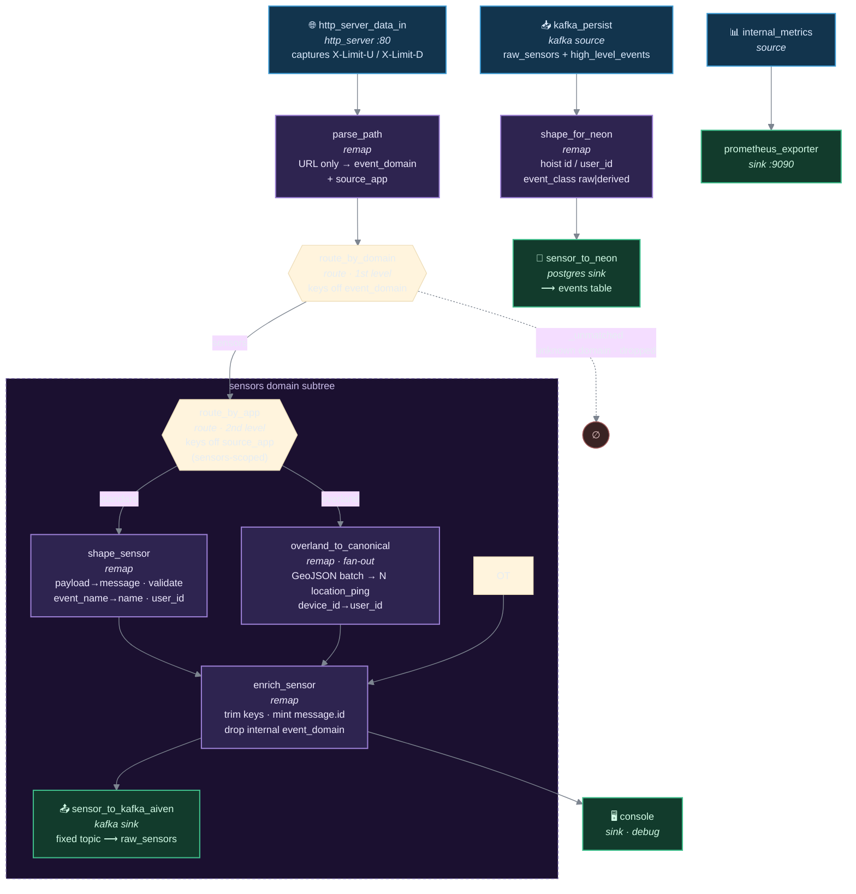

# Vector pipeline — ingest gateway + Neon persister

> **Current truth for Vector.** This documents the live Vector configuration under
> [`deploy/vector/kustomize/base/configs/`](../deploy/vector/kustomize/base/configs/).
> Vector is no longer in the emit path (the Quix runtime produces derived events
> straight to Kafka — see [ADR 0004](adr/0004-scaling-model.md)); it does two jobs only:
> **ingest** (producers POST → `raw_sensors`) and **persist** (Kafka → Neon). The
> message-shaping half of [ADR 0001](adr/0001-message-shaping-pipeline.md) is historical;
> this file supersedes its description of the Vector transforms.

Vector runs three independent lanes that meet only through Kafka.

```mermaid
%%{init: {"theme":"base","themeVariables":{"fontFamily":"ui-monospace, SFMono-Regular, Menlo, monospace","fontSize":"13px","lineColor":"#7d8590","primaryTextColor":"#e6edf3"},"flowchart":{"curve":"basis","nodeSpacing":45,"rankSpacing":55}}}%%
flowchart TD
    %% ===== INGEST LANE =====
    HTTP["🌐 http_server_data_in<br/><i>http_server :80</i><br/>captures X-Limit-U / X-Limit-D"]:::src

    HTTP --> PP["parse_path<br/><i>remap</i><br/>URL only → event_domain<br/>+ source_app"]:::xf

    PP --> RBD{{"route_by_domain<br/><i>route · 1st level</i><br/>keys off event_domain"}}
    RBD -.->|"_unmatched<br/>unknown domain · dropped"| DROP(["∅"]):::drop

    RBD -->|"sensors"| RBA{{"route_by_app<br/><i>route · 2nd level</i><br/>keys off source_app<br/>(sensors-scoped)"}}
    RBA -->|"overland"| OL["overland_to_canonical<br/><i>remap · fan-out</i><br/>GeoJSON batch → N location_ping<br/>device_id→user_id"]:::xf
    RBA -->|"standard"| SS["shape_sensor<br/><i>remap</i><br/>payload→message · validate<br/>event_name→name · user_id"]:::xf

    SS --> ENR
    OL --> ENR
    OT --> ENR["enrich_sensor<br/><i>remap</i><br/>trim keys · mint message.id<br/>drop internal event_domain"]:::xf

    ENR --> KAFKA["📤 sensor_to_kafka_aiven<br/><i>kafka sink</i><br/>fixed topic ⟶ raw_sensors"]:::sink
    ENR --> CON["🖥️ console<br/><i>sink · debug</i>"]:::sink

    subgraph SENSORS ["sensors domain subtree"]
      RBA
      OT
      OL
      SS
      ENR
      KAFKA
    end

    %% ===== PERSIST LANE =====
    KP["📥 kafka_persist<br/><i>kafka source</i><br/>raw_sensors + high_level_events"]:::src
    KP --> SFN["shape_for_neon<br/><i>remap</i><br/>hoist id / user_id<br/>event_class raw|derived"]:::xf
    SFN --> NEON["🐘 sensor_to_neon<br/><i>postgres sink</i><br/>⟶ events table"]:::sink

    %% ===== METRICS LANE =====
    IM["📊 internal_metrics<br/><i>source</i>"]:::src --> PROM["prometheus_exporter<br/><i>sink :9090</i>"]:::sink

    classDef src fill:#12344d,stroke:#3d9bd4,stroke-width:1.5px,color:#dbeafe
    classDef xf fill:#2e2450,stroke:#9b7fd4,stroke-width:1.5px,color:#ede9fe
    classDef sink fill:#123b2c,stroke:#3fbd8b,stroke-width:1.5px,color:#d1fae5
    classDef drop fill:#3a2323,stroke:#a05a5a,stroke-width:1px,color:#e8c9c9
    style SENSORS fill:#1b1030,stroke:#6b5a9e,stroke-width:1px,stroke-dasharray:4 3,color:#c9bce8
```

## 1 · Ingest lane

HTTP in → `parse_path` decodes the `/<domain>/<app>/…` URL **once** into two **nested**
routing levels. **First level**, `route_by_domain` keys off `event_domain` to pick the
destination — `sensors` opens the sensors-domain subtree (unknown domains drop).
**Second level**, that domain's `route_by_app` keys off `source_app` to pick the body
adapter: Overland (a batched GeoJSON body) → `overland_to_canonical`, everything else →
`shape_sensor` (the standard `payload` + `event_name` contract). Both rejoin at
`enrich_sensor` (`message.id` minting) → Aiven Kafka `raw_sensors`. `console` taps
`enrich_sensor` for debug.

### The two location apps have different jobs

Both post to the `sensors` domain and both end up as `location_ping`, but they are not
### Why Overland, and why OwnTracks was removed

There were two location lanes until 2026-08-01. They sat at opposite ends of the
sample-density trade-off, and the sparse one lost:

| | **OwnTracks** (`/sensors/owntracks`, **removed**) | **Overland** (`/sensors/overland`) |
|---|---|---|
| role | **region sensor** — iOS `CLRegion` crossings | **movement tracker** — continuous point stream |
| body | bare `_type` object, one event | `{"locations": [GeoJSON Feature, …]}`, up to 1000 |
| identity | `X-Limit-U` header | `properties.device_id` (set it to the `user_id`) |
| density | ~2 samples per crossing (~100 pings / 13 d observed) | ~1 fix per 11 s while moving |
| decides places | **on the phone** (waypoint label → event name) | **nowhere** — the server decides |

OwnTracks was too sparse to feed the [`geofence`](../src/inference/engines/geofence.py) engine
or any dwell logic, and a waypoint label minted on the phone is a *semantic* decision made by a
dumb sensor: it named a ~100 m iOS-floor ring after a shop, could not be renamed or re-radiused
without the phone, and minted an unbounded `entered_<anything>` namespace on `raw_sensors`.

It went quiet on 2026-07-25 when the waypoints were removed (an ablation had shown `stay` was
unaffected — post-Overland stays are 100 % Overland fixes) and the lane was deleted on
2026-08-01 along with its last consumers, `arrived_home_by_car` / `left_home_by_car` (issue #6).

**What replaced it is not the `geofence` engine.** Zone-crossing detection has still never run
in production — the `regions` table holds only `kind='poi'` rows. Place detection is
[ADR 0007](adr/0007-stays-not-fences.md)'s `stay_window`: cluster Overland's dense fixes into a
dwell, then label the centroid from a POI row. That needs no region declared in advance, and it
is why the dense lane was the one worth keeping.

Two integration facts worth keeping visible:

- **Fan-out is native to `remap`.** Assigning an **array to the root `.`** emits one event
  per element, so a 200-point batch becomes 200 canonical events in one transform — no `lua`.
  Each element must be a complete wrapper; `enrich_sensor` then mints a `message.id` per point.
- **Overland needs `{"result":"ok"}` or it re-sends forever.** Vector's `http_server` replies
  with a bare 200, so the app's **"Consider HTTP 2XX Successful"** setting must be enabled.
  This is a phone-side setting; there is nothing to fix in the pipeline.

Unit alignment is the adapter's job, so one field name keeps one meaning across producers:
Overland's `speed` (m/s) becomes `vel` in km/h, and `battery_level` (0–1) becomes `batt` in
percent. Points iOS marks unusable (`horizontal_accuracy` or `speed` of `-1`) are dropped
**per point**, so one bad fix can't take a whole batch with it.

### URL grammar & two-level routing

The ingest URL is `/<domain>/<app>` — two required segments, decoded only in `parse_path`:

| Segment | Field | Level | Decides |
|---|---|---|---|
| 1st — `domain` | `.event_domain` | **first** (`route_by_domain`) | the **destination topic** — every app in a domain shares it (`sensors` → `raw_sensors`) |
| 2nd — `app` | `.source_app` | **second** (`route_by_app`, domain-scoped) | the **body adapter** — how to shape *this* producer's payload |

> **A nested tree, not two parallel axes.** Domain is the *outer* level and fixes the
> topic; app is the *inner* level and only ever sees its own domain's traffic, so one
> domain's adapters can't mis-shape another's (e.g. `shape_sensor`'s `standard` catch-all
> is safe precisely because non-sensors traffic never reaches it). `event_domain` is
> internal routing state — consumed by the first-level router and dropped in
> `enrich_sensor`, so it never reaches the event wrapper on Kafka.

**No dynamic topics.** The Kafka topic is *not* taken from the URL. Each domain has its
own static-topic sink, so producers can't steer traffic to arbitrary topics. A trailing
3rd path segment (a legacy `/…/raw_sensors`) is *ignored*, not rejected — harmless, and
safe to drop from producer URLs.

**Adding a domain** is one localized subtree: a new `route_by_domain` route → its own
second-level app-router → adapter(s) → a static-topic sink. No other component changes.

### Producers on the `sensors` domain

| `app` segment | Body adapter | Producer |
|---|---|---|
| `overland` | `overland_to_canonical` | iOS Overland — batched GeoJSON point stream |
| `shortcut` | `shape_sensor` (standard) | iOS Shortcuts — power, CarPlay, lock, card payments |
| `bmw` | `shape_sensor` (standard) | [`workers/bmw-cardata/`](../workers/bmw-cardata/) — car telemetry ([ADR 0006](adr/0006-car-native-trip-signals.md)) |
| `gmail` | `shape_sensor` (standard) | **n8n connector** — labelled mail ([ADR 0008](adr/0008-connector-tier-via-n8n.md)) |

> **New third-party sources arrive as n8n connectors, and must not add a transform here.**
> The two `*_to_canonical` adapters exist only because those apps POST directly at us with a
> body shape outside our control. An n8n workflow's body **is** ours, so it emits the canonical
> `{"payload": {event_name, user_id, timestamp}}` and rides the shared `standard` lane —
> `route_by_app` is meant to stop growing. Connectors also stay inside the `sensors` domain,
> because a new domain means a new topic and the runtime permits exactly one external source
> topic. See [`connectors.md`](connectors.md) for the contract.

## 2 · Persist lane

A *separate* Kafka source (`kafka_persist`) reads back `raw_sensors` **and**
`high_level_events` (the runtime's derived output) → `shape_for_neon` → the Neon Postgres
`events` table. Decoupled from ingest — this is the Neon-persister role.

`shape_for_neon` hoists `message.id` → the `id` PK column and `message.user_id` → the
`user_id` column, and sets `event_class` = `raw` | `derived` (derived events carry
`message.inference_type`). `occurred_at` / `ingested_at` are set DB-side by a BEFORE INSERT
trigger, so no timestamp math lives in VRL.

## 3 · Metrics lane

`internal_metrics` → `prometheus_exporter` on `:9090/metrics`. Watch
`vector_buffer_events{component_id="sensor_to_kafka_aiven"}` (and `"sensor_to_neon"`) — a
growing buffer means that sink is the bottleneck.

## Invariants

- **The wrapper is identical for raw and derived events on every topic:**
  `{name, source_app, source_type, message}`. Vector mints `message.id` for raw events
  (`enrich_sensor`); the runtime mints it for derived events. There is no top-level
  "envelope" id. See [CLAUDE.md — "Vector's role"](../CLAUDE.md).
- **The two lanes meet only through Kafka** — Vector writes `raw_sensors`, then reads it
  back on the persist lane. The `high_level_events` feedback enters Vector *only* on the
  persist side; the inference runtime produces it, Vector never emits it.
- **`user_id` is required on ingest** — `shape_sensor` (standard) and
  `overland_to_canonical` (from each point's `device_id`) both reject events without it,
  mirroring the runtime's per-user keying
  ([ADR 0004](adr/0004-scaling-model.md)). The batch lane rejects **per point**, not per POST.
- **VRL is validated locally before deploy** — `vector` 0.57.0 is on the dev box, matching the
  pinned chart version, so there is no excuse for a crash-looping program:
  `vector vrl -i <sample.json> -p <program.vrl>` runs one transform's source, and
  `vector validate --no-environment --config-dir .` checks the whole topology (expect only the
  two `_unmatched` "no consumers" warnings). Extract a program from its YAML with
  `yaml.safe_load(...)["source"]`.
- The graph reflects the components actually enabled in
  [`kustomization.yml`](../deploy/vector/kustomize/base/kustomization.yml) — the in-cluster
  `sensor_to_kafka.yml` variant is not mounted; the Aiven sink is.

## See also

- [connectors.md](connectors.md) — the contract third-party sources POST against, and why
  they add no transform here ([ADR 0008](adr/0008-connector-tier-via-n8n.md)).
- [ADR 0004 — scaling model](adr/0004-scaling-model.md) — why the runtime is out of
  Vector's emit path; the entity-keying rule that makes `user_id` mandatory on ingest.
- [ADR 0001 — message-shaping pipeline](adr/0001-message-shaping-pipeline.md) —
  **historical**; the original typed-envelope shaping decision. This file supersedes its
  Vector-transform description.
